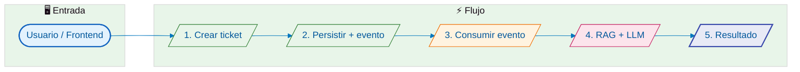
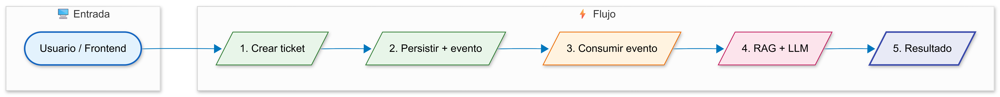
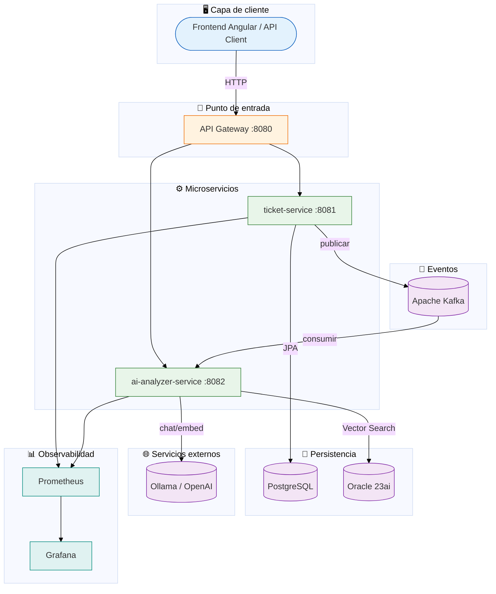
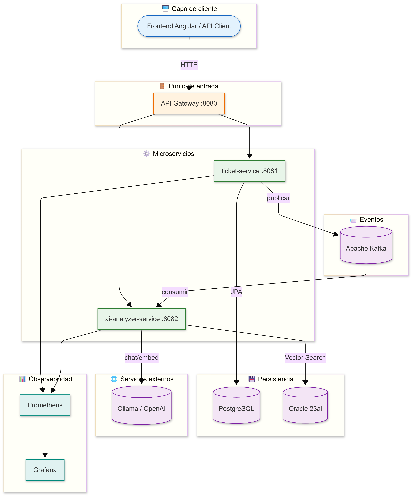
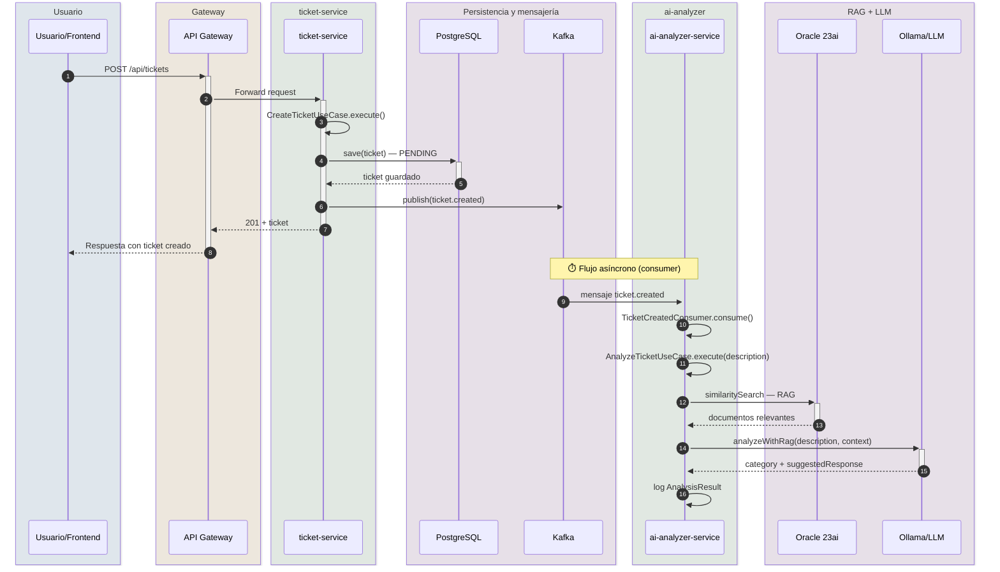
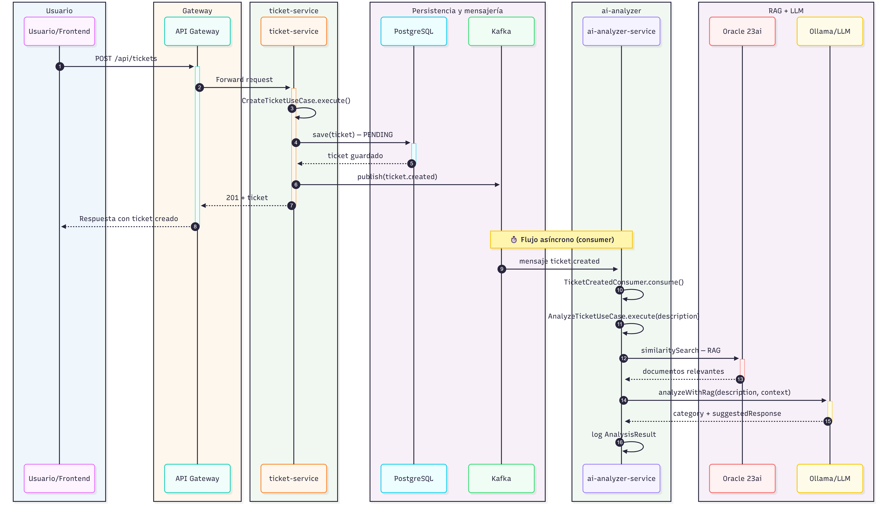
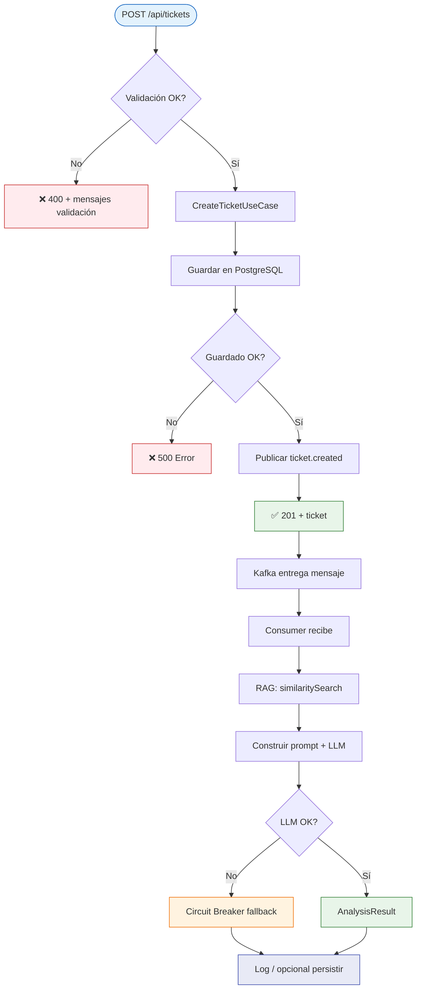
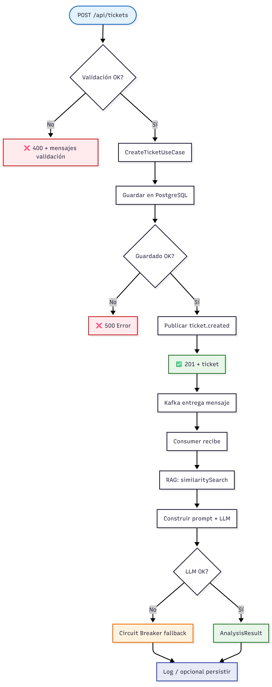

# FLUJO — Cómo funciona OmniSupport AI

Este documento describe el **flujo completo** de la aplicación: desde la entrada del usuario hasta el resultado final. Incluye diagramas, la justificación de cada componente y un resumen de optimización.

---

## Cómo ver los diagramas de forma más visual

Los diagramas están en **Mermaid**. Para verlos con mejor calidad y poder exportarlos:

| Opción | Descripción |
|--------|-------------|
| **Mermaid Live Editor** | Pega el código del bloque `mermaid` en [mermaid.live](https://mermaid.live). Permite exportar a **PNG** o **SVG** y compartir enlace. |
| **VS Code / Cursor** | Extensión **Markdown Preview Mermaid Support** o **Mermaid** para previsualizar en el propio editor. |
| **GitHub / GitLab** | Al abrir este `.md` en el repositorio, los diagramas se renderizan automáticamente. |
| **Exportar a imagen** | En mermaid.live: *Actions → Export → PNG/SVG*. Útil para presentaciones o documentación en PDF. |

---

## 1. Vista general del sistema

OmniSupport AI es una plataforma **event-driven** de soporte: el usuario crea un ticket, el sistema lo persiste, notifica por eventos y un servicio de IA analiza el contenido (RAG + LLM) para sugerir categoría y respuesta.

---

## 2. Diagrama de arquitectura por capas

Componentes y responsabilidades.

---

## 3. Flujo detallado paso a paso (secuencia)

Secuencia desde la petición HTTP hasta el análisis por IA.

---

## 4. Para qué sirve cada componente

| Componente | Función | Justificación |
|------------|--------|----------------|
| **Frontend / API Client** | Envía `POST /api/tickets` con título, descripción y email. | Punto de interacción con el usuario; desacopla UI de backend. |
| **API Gateway (:8080)** | Único punto de entrada HTTP; enruta a ticket-service y ai-analyzer-service; aplica CORS. | Centraliza rutas, CORS y futuros cross-cutting (auth, rate limit). Evita exponer puertos internos. |
| **ticket-service (:8081)** | Crea el ticket, lo persiste en PostgreSQL y publica el evento `ticket.created` en Kafka. | Responsabilidad única: ciclo de vida del ticket y emisión del evento. Arquitectura hexagonal para mantener dominio limpio. |
| **PostgreSQL** | Almacena la tabla `tickets` (id, title, description, contact_email, status, created_at). | Persistencia transaccional y consultas por estado/fecha; tecnología madura y adecuada para datos relacionales del ticket. |
| **Kafka** | Tópico `ticket.created`: mensaje con ticketId y description. | Desacopla creación de ticket del análisis con IA; permite reintentos, múltiples consumidores y no bloquea la respuesta al usuario. |
| **ai-analyzer-service (:8082)** | Consume `ticket.created`, ejecuta RAG + LLM y obtiene categoría y respuesta sugerida. | Responsabilidad única: análisis con IA. Permite escalar y desplegar independientemente del ticket-service. |
| **Oracle 23ai** | Vector store: documentos de base de conocimientos con embeddings; búsqueda por similitud. | RAG: recuperar contexto relevante para el LLM; reduce alucinaciones y mejora respuestas con documentación real. |
| **Ollama / OpenAI** | Embeddings (nomic-embed-text) y chat (llama3.2 u otro). | Genera embeddings para RAG y texto para categoría/respuesta sugerida; configurable según coste y privacidad. |
| **Prometheus + Grafana** | Scrape de métricas (Actuator) y dashboards. | Salud, latencia y uso de recursos; necesario para operación y optimización. |

---

## 5. Desglose del flujo (entrada → proceso final)

### Paso 1 — Entrada

- **Acción:** El cliente envía `POST /api/tickets` con `title`, `description`, `contactEmail`.
- **Quién:** Frontend o cualquier cliente HTTP.
- **Resultado:** La petición llega al API Gateway.

### Paso 2 — Gateway

- **Acción:** El Gateway reenvía a `ticket-service` según la ruta `/api/tickets/**`.
- **Quién:** Spring Cloud Gateway.
- **Resultado:** La petición llega al controlador REST del ticket-service.

### Paso 3 — Creación del ticket

- **Acción:** `TicketController` recibe el body, valida (p. ej. `@Valid`) y llama a `CreateTicketUseCase.execute(title, description, contactEmail)`.
- **Quién:** ticket-service (capa aplicación + dominio).
- **Detalle:** Se crea un `Ticket` en dominio con estado `PENDING`, se persiste vía `TicketRepository` (JPA → PostgreSQL) y se publica `TicketCreatedEvent` vía `TicketEventPublisher` (adaptador Kafka).
- **Resultado:** Ticket en BD y mensaje en el tópico `ticket.created`. La respuesta HTTP 201 se devuelve al usuario de forma inmediata (no se espera al análisis con IA).

### Paso 4 — Publicación del evento

- **Acción:** `KafkaTicketEventPublisher` serializa el evento (p. ej. JSON con `ticketId`, `description`, etc.) y lo envía al tópico `ticket.created`.
- **Quién:** ticket-service (infraestructura).
- **Resultado:** El evento queda disponible para los consumidores. El flujo síncrono termina aquí para el usuario.

### Paso 5 — Consumo del evento

- **Acción:** `TicketCreatedConsumer` (ai-analyzer-service) recibe el mensaje, deserializa y extrae `ticketId` y `description`.
- **Quién:** ai-analyzer-service (Kafka listener).
- **Resultado:** Se invoca el caso de uso de análisis con la descripción del ticket.

### Paso 6 — RAG (recuperación de contexto)

- **Acción:** `AnalyzeTicketUseCase` llama a `VectorStorePort.similaritySearch(description, RAG_MAX_RESULTS)`. El adaptador usa Oracle 23ai para buscar documentos similares a la descripción.
- **Quién:** ai-analyzer-service (puerto + OracleVectorStore).
- **Detalle:** La descripción se embebe (si hace falta), se hace búsqueda por similitud en Oracle y se devuelve una lista de documentos. Su contenido se concatena como contexto para el LLM.
- **Resultado:** Cadena de contexto (o mensaje tipo “No hay documentación relevante”) lista para el prompt.

### Paso 7 — Análisis con LLM

- **Acción:** `LlmPort.analyzeWithRag(description, context)` construye un prompt que incluye la descripción del ticket y el contexto RAG, y llama al modelo (Ollama/OpenAI). La llamada está protegida por Circuit Breaker (Resilience4j).
- **Quién:** ai-analyzer-service (SpringAiLlmAdapter).
- **Resultado:** Objeto `AnalysisResult` con `category` y `suggestedResponse`. Si el LLM falla, el Circuit Breaker devuelve un fallback (categoría/respuesta por defecto).

### Paso 8 — Proceso final

- **Acción:** El consumer registra el resultado (log). Opcionalmente se puede persistir en BD, enviar a otro tópico o notificar al usuario (p. ej. WebSocket o cola).
- **Quién:** ai-analyzer-service.
- **Resultado:** Flujo de análisis completado; el sistema ha pasado de “entrada del ticket” al “análisis con IA” de forma asíncrona.

---

## 6. Diagrama de flujo (decisión y errores)

---

## 7. Resumen de optimización y recomendaciones

### Ya contemplado en el diseño

- **Desacoplamiento con Kafka:** La creación del ticket no depende de la disponibilidad del LLM; el usuario recibe respuesta rápida y el análisis se hace en segundo plano.
- **Circuit Breaker en LLM:** Evita saturar el servicio cuando Ollama/OpenAI falla o va lento; se devuelve un fallback controlado.
- **RAG con Oracle 23ai:** Menos alucinaciones y respuestas más alineadas con la base de conocimientos.
- **Actuator + Prometheus:** Métricas listas para detectar cuellos de botella (latencia, errores, throughput).
- **Arquitectura hexagonal:** Facilita cambiar BD, mensajería o proveedor de IA sin tocar el dominio.
- **Virtual Threads (Java 21):** Mejor concurrencia con el mismo modelo de programación.

### Optimizaciones recomendadas

| Área | Recomendación |
|------|----------------|
| **Latencia del consumer** | Ajustar `max.poll.records` y tamaño de lote para equilibrar throughput y tiempo de procesado por mensaje. |
| **RAG** | Ajustar `RAG_MAX_RESULTS` y umbral de similitud según calidad/coste; indexar bien la base de conocimientos en Oracle. |
| **LLM** | Usar timeouts y reintentos acotados; en producción considerar modelos más rápidos o caché de respuestas para consultas repetidas. |
| **Persistencia del resultado** | Persistir `AnalysisResult` (p. ej. en PostgreSQL o en Oracle) y/o publicar evento `ticket.analyzed` para que el frontend o otros servicios reaccionen. |
| **Escalado** | Varias instancias del ai-analyzer-service con el mismo `groupId` para reparto de carga; ticket-service stateless para escalar horizontalmente. |
| **Observabilidad** | Trazas distribuidas (p. ej. Micrometer Tracing + Zipkin/Jaeger) para seguir una petición desde el Gateway hasta el consumer y el LLM. |
| **Seguridad** | En producción: autenticación/autorización en el Gateway, secrets para BD y API keys, y validación estricta de entradas. |

### Métricas a vigilar

- Tiempo de respuesta de `POST /api/tickets` (p50, p95).
- Lag del consumer de `ticket.created`.
- Latencia de `similaritySearch` en Oracle y de la llamada al LLM.
- Tasa de apertura del Circuit Breaker y de fallbacks.

---

## 8. Resumen ejecutivo

| Fase | Componente principal | Entrada | Salida |
|------|----------------------|--------|--------|
| Entrada | API Gateway | HTTP POST con ticket | Reenvío a ticket-service |
| Creación | ticket-service | Datos del ticket | Ticket en PostgreSQL + evento en Kafka |
| Respuesta al usuario | ticket-service → Gateway | — | 201 + ticket |
| Procesamiento asíncrono | ai-analyzer-service | Mensaje Kafka | — |
| RAG | Oracle 23ai | Descripción del ticket | Documentos similares |
| Análisis | LLM (Ollama/OpenAI) | Descripción + contexto RAG | Categoría + respuesta sugerida |
| Cierre | Consumer | AnalysisResult | Log / (opcional) persistencia o nuevo evento |

El flujo va **de la entrada del usuario** (crear ticket) **al proceso final** (análisis con IA) pasando por gateway, persistencia, eventos y RAG+LLM, con desacoplamiento, resiliencia y observabilidad considerados en el diseño y en las mejoras sugeridas.
